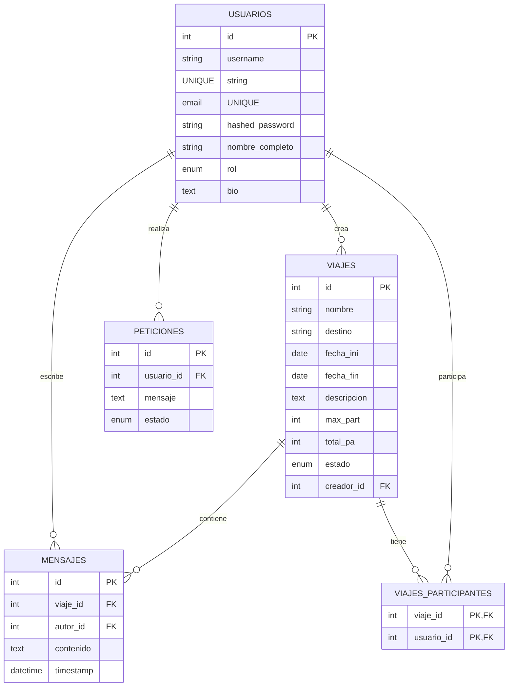

# Memoria del Proyecto TravelConnect

## 1. Introducción y Objetivos

### 1.1 Descripción de TravelConnect

**TravelConnect** es una plataforma web diseñada para facilitar la gestión y descubrimiento de viajes colaborativos. 

  La aplicación permite a los usuarios:

- **Crear viajes** como creadores de contenido
- **Descubrir viajes disponibles** y unirse a ellos como viajeros
- **Comunicarse en tiempo real** mediante un sistema de chat integrado en cada viaje
- **Solicitar promociones de rol** (de Viajero a Creador)
- **Administración de usuarios** para administradores del sistema

### 1.2 Objetivos del Proyecto

1. **Objetivo Principal**: Desarrollar una plataforma de viajes colaborativos con interfaz intuitiva y backend con encriptacion de contraseña y roles de usuario
2. **Objetivos Secundarios**:
   - Implementar autenticación y autorización seguras
   - Crear un sistema de comunicación en tiempo real (WebSockets)
   - Garantizar accesibilidad WCAG AA
   - Aplicar principios de UX/UI modernos
   - Proporcionar una experiencia de usuario fluida y responsiva

### 1.3 Stack Tecnológico

**Frontend:**
- React 19.2.0
- React Router DOM 7.12.0
- Vite 7.2.4
- CSS3 (sin frameworks CSS)

**Backend:**
- FastAPI 0.95+
- SQLAlchemy 1.4+
- PyMySQL 1.0+
- WebSockets 12.0+
- JWT para autenticación

**Base de Datos:**
- MySQL

## 2 Disseny UI/UX:

### 2.1 Figma
No hacemos figma

### 2.2 Guía de Estilos

#### Paleta de Colores

| Color            | Código HEX | Uso                          |
|------------------|------------|------------------------------|
| Azul Primario    | #646cff    | Botones, Enlaces principales |
| Azul Oscuro      | #535bf2    | Estado hover, Activos        |
| Gris Claro       | #f5f5f5    | Fondo general                |
| Gris Medio       | #ccc       | Bordes, Separadores          |
| Gris Oscuro      | #333       | Textos principales           |
| Gris Muy Oscuro  | #213547    | Textos secundarios           |


#### Tipografía

```
Font Family: system-ui, Avenir, Helvetica, Arial, sans-serif

Escalas de texto:
- H1: 2.2rem
- Párrafos: 1rem
- Botones: 1em
```

#### Componentes Principales

1. **Header**: Navegación sticky con logo y menú
2. **Formularios**: Inputs con validación visual
3. **Botones**: Estilos consistentes con transiciones suaves
4. **Tarjetas**: Componentes para mostrar viajes

### 2.3 Criterios de Accesibilidad Aplicados

#### 2.3.1 Implementación de WAI-ARIA

**Atributos ARIA utilizados:**

```jsx
// En formularios
<label htmlFor="email">Email:</label>
<input 
  id="email"
  type="email" 
  aria-label="Correo electrónico"
  aria-required="true"
/>

// En componentes complejos
<div role="navigation" aria-label="Navegación principal">
  {/* Enlaces de navegación */}
</div>

// En alertas
<div role="alert" aria-live="polite">
  Las contraseñas no coinciden
</div>
```

#### 2.3.2 Estándares de Accesibilidad WCAG AA Aplicados

1. **Contraste de Colores**:
   - Relación de contraste mínimo 4.5:1 para textos
   - Relación 3:1 para elementos gráficos

2. **Navegación por Teclado**:
   - Todos los botones y enlaces accesibles mediante Tab
   - Focus visible con outline 4px

3. **Textos Alternativos**:
   - Todos los `` con atributo `alt` descriptivo
   - Logos con `alt="Logo TravelConnect"`

4. **Estructura Semántica**:
   - Uso correcto de etiquetas HTML5 (`<header>`, `<nav>`, `<main>`, `<footer>`)
   - Orden lógico de headings (H1 > H2 > H3)

### 2.4 Aplicación de Leyes UX/UI

#### Ley de Proximity (Proximidad)
- Agrupación de elementos relacionados
- Espaciado consistente entre secciones

#### Ley de Similarity (Similaridad)
- Botones similares con estilos consistentes
- Inputs del formulario con diseño uniforme

#### Ley de Closure (Cierre)
- Formas visuales completas en tarjetas
- Bordes y separadores claros

#### Ley de Continuidad
- Elementos alineados verticalmente
- Flujo visual natural de arriba a abajo

### 2.5 Justificación de Usabilidad

1. **Diseño Intuitivo**: La navegación principal es clara y accesible desde cualquier página
2. **Consistencia**: Todos los botones y formularios siguen patrones similares
3. **Retroalimentación Visual**: Estados hover y focus claramente visibles
4. **Responsividad**: Adaptable a diferentes tamaños de pantalla
5. **Minimalismo**: Sin elementos superfluos que distraigan al usuario

---

## 3. Informe de Accesibilidad

### 3.1 Checklist WCAG AA

| Criterio                                   | Cumplido | Notas                                      |
|------------------------------------------- |----------|--------------------------------------------|
| 1.1.1 Contenido no textual (A)             | ✓        | Todos los `` tienen `alt` descriptivos|
| 1.4.3 Contraste (AA)                       | ✓        | Relación mínima 4.5:1                      |
| 2.1.1 Teclado (A)                          | ✓        | Navegación completa por teclado            |
| 2.4.7 Focus Visible (AA)                   | ✓        | Outline visible en todos los interactivos  |
| 3.3.1 Identificación de Errores (A)        | ✓        | Mensajes de error claros                   |
| 3.3.2 Etiquetas o Instrucciones (A)        | ✓        | Labels correctamente asociados             |
| 4.1.2 Nombre, Rol, Valor (A)               | ✓        | Atributos ARIA implementados               |
| 4.1.3 Mensajes de Estado (AA)              | ✓        | aria-live para notificaciones              |


### 3.2 Uso de WAI-ARIA en Componentes Complejos

#### 3.2.1 Sistema de Chat

```jsx
// Header del chat
<div role="heading" aria-level="2">
  Chat del Viaje: {tripName}
</div>

// Contenedor de mensajes
<div 
  role="log" 
  aria-label="Historial de mensajes"
  aria-live="polite"
  aria-atomic="false"
>
  {messages.map(msg => (
    <div role="article" key={msg.id} aria-label={`Mensaje de ${msg.autor_username}`}>
      <strong>{msg.autor_username}:</strong>
      <p>{msg.contenido}</p>
      <time>{msg.timestamp}</time>
    </div>
  ))}
</div>

// Input de envío
<form onSubmit={handleSendMessage} aria-label="Formulario de envío de mensaje">
  <input 
    type="text"
    placeholder="Escribe un mensaje..."
    aria-label="Campo de texto para nuevo mensaje"
  />
  <button type="submit" aria-label="Enviar mensaje">
    Enviar
  </button>
</form>
```

---

## 4. Arquitectura Técnica

### 4.1 Diagrama de Base de Datos (MySQL)



#### Descripción de Tablas

**USUARIOS**
- Almacena información de todos los usuarios registrados
- Roles: Viajero (por defecto), Creador, Administrador

**VIAJES**
- Información de viajes disponibles
- Estados: planificado, activo, completado, cancelado
- Relación con creador (Usuario)

**VIAJES_PARTICIPANTES**
- Tabla de asociación Many-to-Many
- Vincula usuarios a los viajes en que están inscritos

**MENSAJES**
- Almacena mensajes del chat de cada viaje
- Referencia a viaje y autor

**PETICIONES**
- Solicitudes de promoción de rol
- Estados: Pendiente, Aprobado, Rechazado

### 4.2 Estructura de API (FastAPI)

#### Base URL
```bash

# servidor 

http://localhost:8000

# cliente

http://localhost:5173
```

#### Endpoints de Autenticación

```
POST /auth/register
├─ Request:
│  ├─ username: string (requerido)
│  ├─ email: string (requerido)
│  ├─ password: string (requerido)
│  └─ full_name: string (opcional)
└─ Response: Usuario creado con token

POST /auth/login
├─ Request: OAuth2PasswordRequestForm
│  ├─ username: string
│  └─ password: string
└─ Response: { access_token, token_type }

```

#### Endpoints de Usuarios

```
GET /users/me
├─ Auth: Bearer Token (requerido)
└─ Response: Perfil del usuario autenticado

PUT /users/me
├─ Auth: Bearer Token (requerido)
├─ Request: { nombre_completo?, bio? }
└─ Response: Usuario actualizado
```

#### Endpoints de Viajes

```
GET /trips/
├─ Auth: No requerido
└─ Response: List[ViajeResponse]

GET /trips/{id}
├─ Auth: No requerido
└─ Response: ViajeResponse

POST /trips/{id}/enroll
├─ Auth: Bearer Token (requerido)
├─ Request: vacío
└─ Response: ViajeResponse

POST /trips/{id}/leave
├─ Auth: Bearer Token (requerido)
├─ Request: vacío
└─ Response: ViajeResponse
```

#### Endpoints de Creador

```
POST /creator/trips
├─ Auth: Bearer Token (requerido, rol: Creador/Admin)
├─ Request: ViajeCreate
└─ Response: ViajeResponse (201)

PUT /creator/trips/{id}
├─ Auth: Bearer Token (requerido)
├─ Request: ViajeUpdate
└─ Response: ViajeResponse

DELETE /creator/trips/{id}
├─ Auth: Bearer Token (requerido)
├─ Request: vacío
└─ Response: { detail: "Viaje eliminado" }
```

#### Endpoints de Chat

```
GET /trips/{id}/chat
├─ Auth: Bearer Token (requerido)
└─ Response: List[ChatMessageResponse]

POST /trips/{id}/chat/send
├─ Auth: Bearer Token (requerido)
├─ Request: { contenido: string }
└─ Response: ChatMessageResponse (201)

WebSocket /ws/{trip_id}/chat?token=...
├─ Auth: Query param token (requerido)
├─ Mensaje entrada: { contenido: string }
└─ Broadcast: ChatMessageResponse en tiempo real
```

#### Endpoints de Administrador

```
GET /admin/users
├─ Auth: Bearer Token (Admin)
└─ Response: List[UsuarioResponse]

PUT /admin/users/{user_id}/promote
├─ Auth: Bearer Token (Admin)
├─ Request: { rol: "Viajero" | "Creador" | "Administrador" }
└─ Response: UsuarioResponse

GET /admin/promotions
├─ Auth: Bearer Token (Admin)
└─ Response: List[PeticionPromocionResponse]

PUT /admin/promotions/{promotion_id}
├─ Auth: Bearer Token (Admin)
├─ Request: { estado: "Aprobado" | "Rechazado" }
└─ Response: PeticionPromocionResponse
```

#### Endpoints de Promoción

```
POST /promote-request
├─ Auth: Bearer Token (requerido)
├─ Request: { mensaje_peticion: string }
└─ Response: PeticionPromocionResponse (201)
```

### 4.3 Componentes React y Gestión de Estado

#### Estructura de Componentes

```
frontend/src/
├── App.jsx                    # Router principal
├── index.css                  # Estilos globales
├── main.jsx                   # Entry point
│
├── componentes/
│   ├── Header.jsx            # Navegación (exportado)
│   ├── Header.css
│   ├── Logo.jsx              # Logo (exportado)
│   └── Logo.css
│
└── paginas/
    ├── paginaInicio.jsx      # Home (exportado)
    ├── paginaInicio.css
    ├── registrar.jsx         # Sign up (exportado)
    ├── registrar.css
    ├── inicioSesion.jsx      # Login (exportado)
    └── inicioSesion.css
```

#### Componentes Principales

**[Header](frontend/src/componentes/Header.jsx)**
- Navegación principal sticky
- Logo + título
- Enlaces a autenticación y registro
- Responsive

**[Registrar](frontend/src/paginas/registrar.jsx)**
- Formulario de registro con validación
- Estados: nombre, email, password
- Manejo de errores

**[InicioSesion](frontend/src/paginas/inicioSesion.jsx)**
- Formulario de login
- Validación de credenciales
- Integración con API

**[PaginaInicio](frontend/src/paginas/paginaInicio.jsx)**
- Landing page con bienvenida
- Descripción del servicio

#### Gestión de Estado

Actualmente se utiliza **React Hooks** (useState, useContext) para estado local. 

```jsx
// AuthContext.jsx
import { createContext, useState, useCallback } from 'react';

export const AuthContext = createContext();

export function AuthProvider({ children }) {
  const [user, setUser] = useState(null);
  const [token, setToken] = useState(localStorage.getItem('token'));
  const [loading, setLoading] = useState(false);

  const login = useCallback(async (username, password) => {
    setLoading(true);
    try {
      const response = await fetch('http://localhost:8000/auth/login', {
        method: 'POST',
        headers: { 'Content-Type': 'application/x-www-form-urlencoded' },
        body: `username=${username}&password=${password}`
      });
      
      if (!response.ok) throw new Error('Login fallido');
      
      const data = await response.json();
      setToken(data.access_token);
      localStorage.setItem('token', data.access_token);
      
      // Fetch user profile
      const userResponse = await fetch('http://localhost:8000/users/me', {
        headers: { 'Authorization': `Bearer ${data.access_token}` }
      });
      const userData = await userResponse.json();
      setUser(userData);
      
      return userData;
    } finally {
      setLoading(false);
    }
  }, []);

  const logout = useCallback(() => {
    setUser(null);
    setToken(null);
    localStorage.removeItem('token');
  }, []);

  return (
    <AuthContext.Provider value={{ user, token, loading, login, logout }}>
      {children}
    </AuthContext.Provider>
  );
}
```
---

## 4.4 Cambios recientes 

### Frontend

#### Nuevas páginas y rutas
- **Redirección de usuarios no logueados** Aquel que intente acceder a cualquier página será redirigido al login del frontend (`/inicioSesion`) para que se registre previamente.
- **Panel de administración** en [frontend/src/paginas/adminDashboard.jsx](frontend/src/paginas/adminDashboard.jsx): vista protegida por rol Administrador.
- **Gestión de usuarios (admin)** en [frontend/src/paginas/adminUsuarios.jsx](frontend/src/paginas/adminUsuarios.jsx): listado y acciones administrativas.
- **Gestión de peticiones (admin)** en [frontend/src/paginas/peticionesAdmin.jsx](frontend/src/paginas/peticionesAdmin.jsx): aprobación/rechazo de promociones.
- **Chat de viaje** en [frontend/src/paginas/chatViaje.jsx](frontend/src/paginas/chatViaje.jsx): carga de histórico y envío de mensajes por viaje.
- **Perfil de usuario** en [frontend/src/paginas/perfil.jsx](frontend/src/paginas/perfil.jsx): edición de `nombre_completo` y `bio`.
- **Router principal actualizado** en [frontend/src/App.jsx](frontend/src/App.jsx) con rutas públicas/protegidas y rutas de administración.

#### Mejoras en componentes
- **Header dinámico** en [frontend/src/componentes/Header.jsx](frontend/src/componentes/Header.jsx):
  - Renderizado por autenticación y rol.
  - Enlaces condicionales a crear viaje, promoción y panel admin.
  - Cierre de sesión limpiando `localStorage`.

#### Estilos incorporados
- [frontend/src/estilos/adminDashboard.css](frontend/src/estilos/adminDashboard.css)
- [frontend/src/estilos/adminUsuarios.css](frontend/src/estilos/adminUsuarios.css)
- [frontend/src/estilos/peticionesAdmin.css](frontend/src/estilos/peticionesAdmin.css)
- [frontend/src/estilos/chatViaje.css](frontend/src/estilos/chatViaje.css)
- [frontend/src/estilos/dashboard.css](frontend/src/estilos/dashboard.css)
- [frontend/src/estilos/detalleViaje.css](frontend/src/estilos/detalleViaje.css)
- [frontend/src/estilos/crearViaje.css](frontend/src/estilos/crearViaje.css)
- [frontend/src/estilos/editarViaje.css](frontend/src/estilos/editarViaje.css)
- [frontend/src/estilos/perfil.css](frontend/src/estilos/perfil.css)
- [frontend/src/estilos/formCreador.css](frontend/src/estilos/formCreador.css)

---

### Backend

#### Routers añadidos y ampliados
- **Administración** en [backend/app/routers/admin.py](backend/app/routers/admin.py): usuarios y promociones (`GET /admin/users`, `PUT /admin/users/{user_id}/promote`, `GET /admin/promotions`, `PUT /admin/promotions/{promotion_id}`).
- **Chat** en [backend/app/routers/chat.py](backend/app/routers/chat.py): histórico, envío REST y WebSocket.
- **Promoción** en [backend/app/routers/promocion.py](backend/app/routers/promocion.py): `POST /promote-request`.
- **Usuario autenticado** en [backend/app/routers/usuario.py](backend/app/routers/usuario.py): `GET/PUT /users/me`.
- Registro global de routers en [backend/app/main.py](backend/app/main.py).

#### Lógica de negocio (CRUD)
- Viajes en [backend/app/crud/viaje.py](backend/app/crud/viaje.py):
  - Validación para no reducir `maximo_participantes` por debajo de inscritos.
  - Inscripción y desinscripción con control de estado/cupo.
- Chat en [backend/app/crud/chat.py](backend/app/crud/chat.py):
  - Validación de mensaje no vacío y persistencia con timestamp.
- Promociones en [backend/app/crud/peticion.py](backend/app/crud/peticion.py):
  - Evita múltiples peticiones pendientes por usuario.

#### Modelos y esquemas
- Modelos: [backend/app/models/mensajesXat.py](backend/app/models/mensajesXat.py), [backend/app/models/peticionPromocion.py](backend/app/models/peticionPromocion.py)
- Schemas: [backend/app/schemas/chat.py](backend/app/schemas/chat.py), [backend/app/schemas/peticionPromocion.py](backend/app/schemas/peticionPromocion.py), [backend/app/schemas/usuario.py](backend/app/schemas/usuario.py), [backend/app/schemas/viajero_viaje.py](backend/app/schemas/viajero_viaje.py)

---

### Configuración y seguridad

- **CORS ampliado** en [backend/app/main.py](backend/app/main.py) para `localhost` y `127.0.0.1` en puertos `5173` y `5500`.
- **Inicialización de tablas** en [backend/app/db/init_db.py](backend/app/db/init_db.py).
- **Autenticación y roles** centralizados con JWT y comprobación de permisos en routers.
- **Conexión y sesión SQLAlchemy** en [backend/app/db/database.py](backend/app/db/database.py) y [backend/app/db/deps.py](backend/app/db/deps.py).

---

## 5. Conclusiones y Mejoras Futuras

### 5.1 Conclusiones Alcanzadas

1. **Plataforma Funcional**: Se ha logrado implementar todas las funcionalidades core:
   - Autenticación y autorización
   - Gestión de viajes
   - Sistema de chat en tiempo real
   - Roles de usuario
   - Administración

2. **Seguridad**: Implementación de JWT y validación de contraseñas con hash PBKDF2-SHA256

3. **Escalabilidad**: Arquitectura modular en FastAPI y componentes reutilizables en React

4. **Accesibilidad**: Cumplimiento de WCAG AA con WAI-ARIA


## Dependencias necesarias en archivo requirements.txt
```bash

sqlalchemy>=1.4
fastapi>=0.95
uvicorn[standard]>=0.22
pymysql>=1.0
pydantic>=1.10
python-jose[cryptography]>=3.3.0
passlib>=1.7.4
PyJWT>=2.8.0
websockets>=12.0
email-validator>=2.0
python-multipart>=0.0.6
```
## Comandos Útilizados

### Backend

```bash

# Instalar dependencias
pip install -r requirements.txt

# Ejecutar servidor
source venv/bin/activate
python -m uvicorn backend.app.main:app --reload

# Crear tablas
python -m backend.app.db.init_db
```

### Frontend

```bash
# Instalar dependencias
cd frontend
npm install

# Desarrollo
npm run dev

# Build producción
npm run build

# Lint
npm run lint
```
## Comandos git utilizados
```bash
# Iniciar repositorio
git init
git branch -M main
git remote add origin git@github.com:GerardLorente34/GerardLorenteAlexPerezOriolChivaTravelConnectM6M7.git
git push -u origin main

# Clonar repositorio existente
git clone git@github.com:GerardLorente34/GerardLorenteAlexPerezOriolChivaTravelConnectM6M7.git

# Comandos git del proyecto

# Subir cambios
git add .
git commit -m "cambios en proyecto"
git push -u origin main

# Obtener cambios
git add .
git pull origin main

---
```

## Información del Proyecto

- **Equipo**: Gerard Lorente, Álex Pérez, Oriol Chiva
- **Módulos**: M7 (Desarrollo servidor)-> Gerard y Oriol, M6 (Diseño de interfaces web)-> Alex Pérez
- **Centro**: IES Ferreria
- **Año**: 2025-2026


